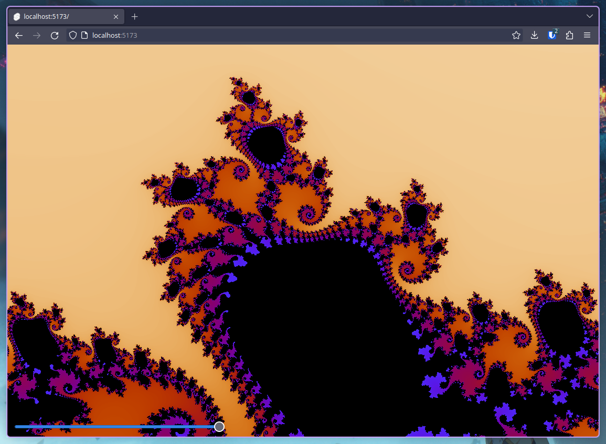

# mandelbrot-renderer
WASM + Svelte renderer for the Mandelbrot fractal. Made as a fun exercise for Rust and WASM.

## Dependencies
- [wasm-pack](https://rustwasm.github.io/wasm-pack/installer/)
- [Rust](https://www.rust-lang.org/tools/install)
- [Node.js](https://nodejs.org/en/download/) (>= 16.13)

## Running
1. Make sure you've got the deps installed
2. Run `make build`
3. Run `make serve`, then open `localhost:3000` in your browser

| :memo:        | Change `max_iter` in [canvas.svelte](./ui/src/lib/canvas.svelte) for more/less detail       |
|---------------|:------------------------|